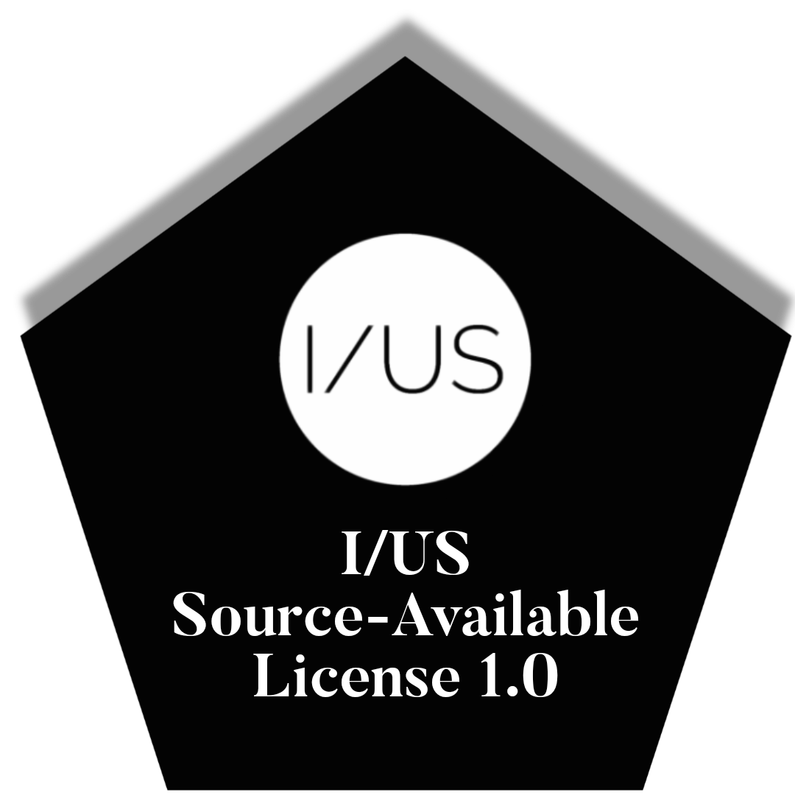
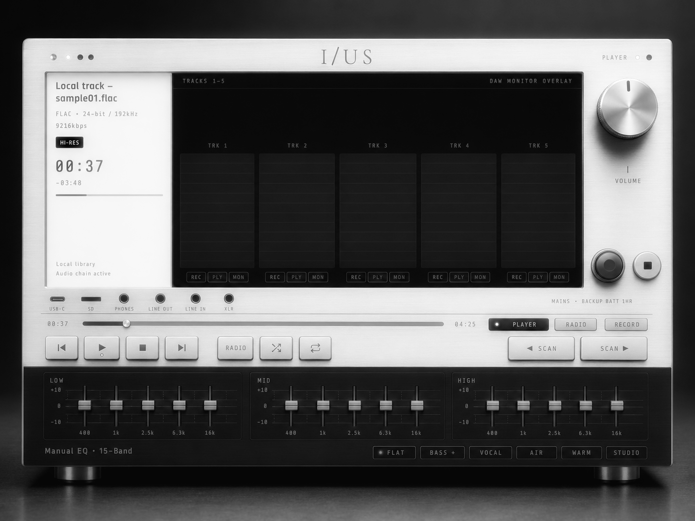
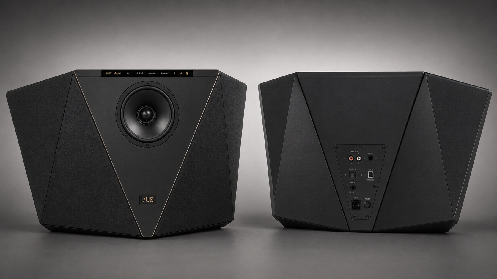
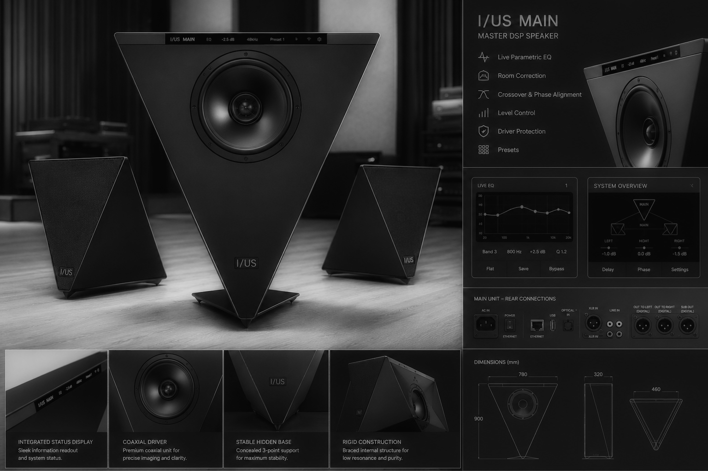

# IUS DRRP Desktop

**Repository:** IUS-DDRP  
**Document baseline:** 30 June 2026  
**Status:** realistic prototype architecture; not yet a production-certified product

IUS DRRP Desktop is a tactile, high-fidelity recorder, player, monitor controller and offline-capable radio platform. The design combines a dedicated real-time audio path with a Linux application layer, premium physical controls, an optically bonded touchscreen, internal loudspeakers, balanced studio I/O and broad phone, tablet, TV and computer connectivity.

The architecture is deliberately split into two domains:

- a deterministic audio domain for monitoring, EQ, routing, conversion and protection
- an application domain for the interface, library, networking, recording management and updates

This separation is the main engineering decision behind the low-latency target. A general-purpose Linux computer is not allowed to sit in the direct monitoring loop.

## Design priorities

- transparent playback and recording
- wired monitoring with near-immediate response
- responsive touch and physical controls
- accessible operation without relying on touch alone
- connection to phones, tablets, computers, TVs, active monitors and studio equipment
- modular internal boards that can be serviced or upgraded
- mains operation with a continuity battery
- quiet thermal behaviour
- premium, durable materials
- an offline-first local workflow

“No latency” is not physically possible. The project therefore defines measurable latency budgets:

- analog input to wired headphone monitor: **5 ms or less target**
- physical control to audible parameter change: **10 ms or less target**
- touch to visible response: **50 ms or less target**
- wireless latency: protocol-dependent and not used for critical live monitoring

## Reference hardware direction

- Raspberry Pi Compute Module 5 for UI, storage and network services
- XMOS XU316 USB Audio Class bridge for deterministic host audio transport
- Analog Devices ADAU1467 DSP for EQ, routing, crossover, limiting and monitoring
- AKM AK4191 + AK4499EX flagship stereo playback path
- ESS ES9823PRO stereo capture path
- THAT1580/5173 digitally controlled microphone preamplifiers
- TI OPA1612 line stages and OPA1622/INA1620 headphone stage
- TI TPA3255 Class-D amplification for the internal speaker system
- 10.1-inch 1920 × 1200 optically bonded capacitive display
- NXP IW612-class Wi-Fi 6 / Bluetooth 5.4 radio module for the production path
- 8-series LiFePO4 continuity battery with monitored power-path control
- CNC-machined and formed aluminum enclosure with constrained-layer damping
- isolated left/right speaker chambers and an RF-transparent antenna window

The reference parts are engineering selections, not purchase guarantees. Every active component must pass availability, lifecycle, licensing and second-source review before an EVT build.

## Product scope

The baseline product is **stereo-first**. It provides:

- two balanced mic/line inputs
- two balanced line outputs
- dedicated headphone monitoring
- USB Audio Class 2
- optical and coaxial S/PDIF
- MIDI input/output
- HDMI display output
- an optional licensed HDMI eARC input module
- local playback and recording
- 15-band tactile EQ
- five-track project and monitor view
- internal stereo loudspeakers
- remote control from a responsive browser interface

The five-track interface is a project and monitoring workflow. It does not imply five simultaneous analog microphone inputs in the baseline hardware.

## Documents

All project documents are kept in the repository root.

- [PRODUCT_REQUIREMENTS.md](./PRODUCT_REQUIREMENTS.md) — measurable product requirements and acceptance targets
- [SYSTEM_ARCHITECTURE.md](./SYSTEM_ARCHITECTURE.md) — system blocks, signal flow, clocking and latency
- [HARDWARE_ARCHITECTURE.md](./HARDWARE_ARCHITECTURE.md) — detailed electrical, mechanical and material plan
- [INTERFACE_SPECIFICATION.md](./INTERFACE_SPECIFICATION.md) — physical, wireless and software interfaces
- [EQ_DSP_SPEC.md](./EQ_DSP_SPEC.md) — EQ, routing, crossover, limiter and metering contract
- [SOFTWARE_ARCHITECTURE.md](./SOFTWARE_ARCHITECTURE.md) — services, UI, storage, updates and security
- [BOM.md](./BOM.md) — reference prototype bill of materials and alternates
- [PROTOTYPE_PLAN.md](./PROTOTYPE_PLAN.md) — staged build plan and engineering gates
- [TEST_AND_VALIDATION.md](./TEST_AND_VALIDATION.md) — audio, latency, thermal, reliability and accessibility tests
- [COMPLIANCE_AND_SAFETY.md](./COMPLIANCE_AND_SAFETY.md) — regulatory, battery, radio and product-security plan
- [BUILD_NOTES.md](./BUILD_NOTES.md) — browser demo instructions and limitations
- [SOURCES.md](./SOURCES.md) — primary component and regulatory references
- [CHANGELOG.md](./CHANGELOG.md) — package changes

## Browser demo

Open `index.html` directly in a current browser.

The demo is self-contained for its generated local test audio and visual interaction. Internet radio still requires a network connection, and microphone recording requires browser permission.

Published demonstrations:

- https://iusmusic.github.io/IUS-DDRP/
- https://iusmusic.github.io/IUS-DRRP/
- https://iusmusic.github.io/DRRPDEMO/

The browser demo is a user-interface prototype. It is not evidence that the final hardware has met the audio, latency, battery, EMC or safety targets in this repository.

## Current engineering decisions

1. The direct monitoring path remains operational if Linux is restarting.
2. The audio DSP owns real-time gain, EQ, crossover, limiter and mute functions.
3. The control microcontroller owns power sequencing, safe mute, watchdogs and battery state.
4. The Compute Module owns the display, library, networking, project files and remote interface.
5. Built-in speakers are internally active and protected; balanced line outputs remain the preferred path to external studio monitors.
6. HDMI eARC, AirPlay, Google Cast, Spotify Connect, aptX and LDAC are certification or licensing workstreams, not assumed open features.
7. The metal enclosure includes an RF window and separate antenna volume.
8. Battery mode limits amplifier power to protect runtime, temperature and cell life.

## Official product name

**IUS DRRP Desktop**

The repository name remains **IUS-DDRP** for continuity.

## License

Copyright (c) 2026 Pezhman Farhangi  
I/US Music

This project includes the I/US source-available license in `LICENSE`.

## Trademark and brand notice

“IUS” and “I/US Music®” are proprietary brand identifiers of I/US Music®.

The license does not grant a right to use the I/US or IUS name, the I/US Music® name, official logos, visual identity, artwork, images, music or other brand assets included in or referenced by this repository. Any use of protected brand features requires prior written permission from I/US Music®.

