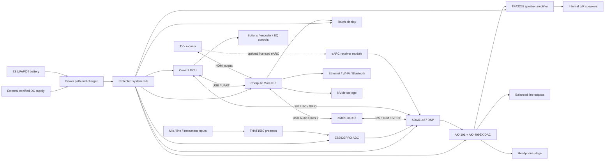
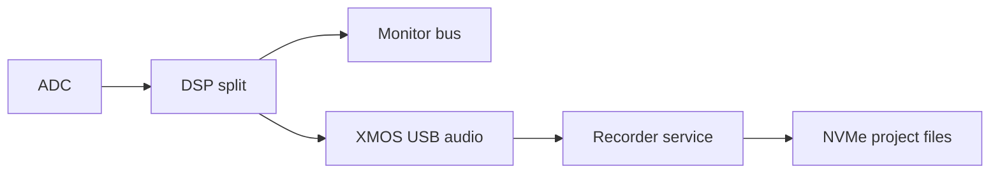

# System architecture

## 1. Architectural objective

The system must deliver deterministic audio behaviour while retaining the flexibility of a modern Linux application platform. The design therefore uses three cooperating controllers:

- **Compute Module 5:** user interface, storage, library, networking and project management
- **XMOS XU316:** USB Audio Class transport, sample movement and deterministic digital I/O
- **Control MCU:** power sequencing, control scanning, battery management, watchdogs and safety mute

The **ADAU1467 DSP** owns the direct audio-monitoring path. Linux can stop, update or restart without removing basic input monitoring, hardware volume, mute, EQ or speaker protection.

## 2. Top-level block diagram

## 3. Audio clock architecture

The audio system shall not use the Linux scheduler as its sample clock.

- two low-phase-noise oscillator families: 22.5792 MHz and 24.576 MHz
- 44.1 kHz-family rates derive from 22.5792 MHz
- 48 kHz-family rates derive from 24.576 MHz
- one selected clock master per operating mode
- asynchronous boundaries use a qualified ASRC where required
- clock switching occurs only while outputs are muted
- S/PDIF inputs are recovered, validated and rate-converted before entering the fixed internal DSP domain
- word-clock output is optional and deferred until the studio-sync use case is validated

The default real-time DSP rate is 96 kHz for recording and monitoring. A 48 kHz power-saving mode may be offered. Playback-only material at other rates may be converted by the XMOS or application layer before the deterministic DSP path.

## 4. Signal paths

### 4.1 Direct monitor

The direct monitor path shall not pass through Linux.

### 4.2 Recording

A dry path is recorded by default. Printed-EQ recording is an explicit project setting.

### 4.3 Playback

### 4.4 TV input

The preferred baseline TV path is optical S/PDIF because it is simple and electrically isolated. HDMI eARC is a production option requiring a compliant receiver, HDMI adopter status, interoperability testing and licence review.

## 5. Latency budget

| Stage | Budget |
|---|---:|
| ADC group delay | ≤0.8 ms |
| DSP frame and filters | ≤1.5 ms |
| DAC group delay | ≤0.8 ms |
| Safety margin and routing | ≤1.9 ms |
| **Direct-monitor total** | **≤5.0 ms** |

The latency budget is measured analog input to headphone output at 96 kHz. Wireless paths are excluded.

## 6. Control architecture

The control MCU scans:

- master encoder
- transport buttons
- mode buttons
- 15 EQ controls
- headphone insertion
- output mute relays
- battery and thermal sensors
- amplifier fault lines

The MCU publishes timestamped control events to the Compute Module and writes safety-critical values directly to the DSP. The UI reflects the confirmed DSP state rather than assuming a command succeeded.

## 7. Power states

### Off

- battery shipping FETs open where supported
- no network
- RTC and pack protection only

### Standby

- MCU active
- network optional
- DSP muted
- display off
- low-power wake sources active

### Ready

- DSP, converters and controls active
- UI available
- amplifiers muted until clock lock and rail checks pass

### Playback / record

- all required rails active
- thermal and battery limits enforced
- record-safe shutdown enabled

### Battery continuity

- compute, DSP, converters and display remain active
- speaker power limited
- high-brightness display mode disabled
- user receives runtime warning
- recordings are safely closed before final shutdown

### Fault

- amplifier mute asserted in hardware
- fault reason stored by MCU
- UI restart is not required for safety action
- recovery follows a defined state machine

## 8. Operating modes

### Player

- local, USB or network playback
- five-track project view
- EQ and output routing
- gapless playback where the decoder supports it

### Radio

- DAB/FM module if fitted
- internet radio when online
- station presets stored locally
- time-shift recording optional

### Record

- two analog channels
- dry or processed monitor
- pre-roll buffer
- project recovery journal

### USB interface

- two-in/two-out minimum
- class-compliant UAC2
- optional multichannel loopback
- MIDI over USB

### TV / presentation

- HDMI display output
- optical or eARC audio input
- CEC control only after interoperability testing
- lip-sync delay user adjustable

## 9. Service boundaries

| Service | Owner | Failure behaviour |
|---|---|---|
| Audio DSP | ADAU1467 | continues last safe state |
| USB audio bridge | XU316 | mutes and re-enumerates |
| Physical controls | MCU | remains available |
| UI | CM5 | restarts without audio loss |
| Recorder | CM5 | journal recovery |
| Network services | CM5 | isolated restart |
| Power management | MCU/BMS | hardware shutdown if unsafe |

## 10. Upgrade boundaries

Replaceable or separately revisioned modules:

- Compute Module
- storage module
- wireless module
- display assembly
- converter board
- preamp board
- DSP / USB bridge board
- speaker amplifier
- battery pack
- front-panel control board

Connectors and mounting points should be documented before EVT so that a single board revision does not force a complete enclosure redesign.
