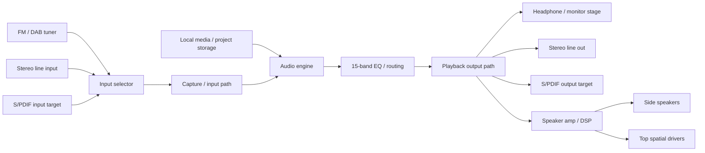
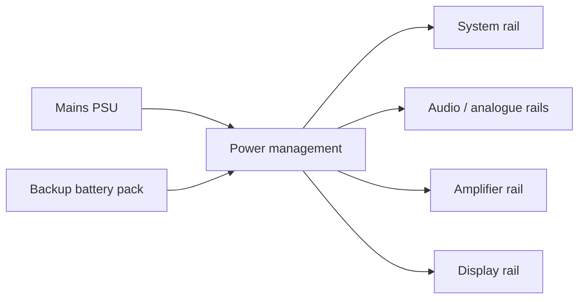
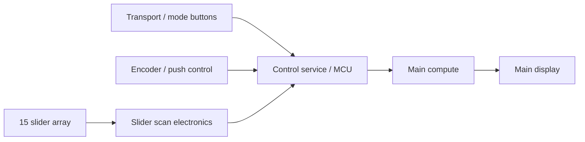

# IUS DRRP Desktop — hardware schematics (updated system level)

These are still **block-level engineering schematics**, not PCB CAD exports.

## 1. Hardware stack

| Block | Updated implementation direction | Notes |
|---|---|---|
| Compute | Pi-class dev path, Compute Module-class product path | separates prototype from product |
| Audio I/O | single coherent DAC / ADC architecture | avoid fragmented audio design |
| Speaker system | side L/R + top spatial path | channel count must be finalised |
| Headphone output | dedicated amplifier stage | independent from line out |
| Line I/O | stereo in / stereo out | external record / monitor connectivity |
| Digital sync | S/PDIF in / out target | matches stereo digital sync request |
| Radio | offline FM / DAB tuner path | region and certification dependent |
| Controls | buttons, encoder, 15-band slider surface | low-latency tactile control |
| Power | mains + continuity battery + management board | no-reboot goal |
| Display | main UI display with graph + track overlay | primary visual monitor |

## 2. Updated audio signal path

## 3. Power path

## 4. Control path

## 5. Engineering warnings

- Do not assume separate audio add-ons can simply be stacked into one reliable product audio interface.
- Final internal speaker design must match the chosen DAC / amp channel architecture.
- Radio, amplifier power, and digital compute sections need noise isolation.
- A backup battery is only useful if the power architecture truly avoids brownout / reboot behaviour.
