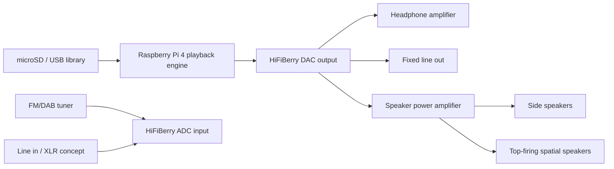
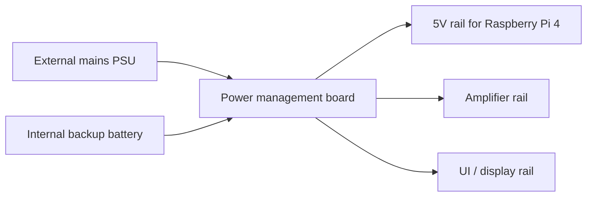
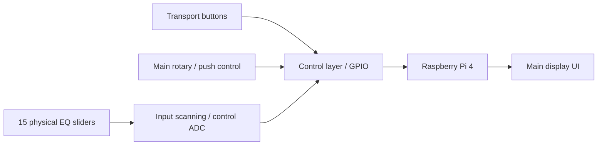

# IUS DRRP Desktop — hardware schematics (system level)

These are concept-grade, system-level schematics suitable for architecture review and GitHub documentation. They are not production PCB CAD exports.

## 1. Core hardware stack

| Block | Proposed implementation | Notes |
|---|---|---|
| Compute | Raspberry Pi 4 | Main UI, playback, recording, control logic |
| Audio I/O | HiFiBerry DAC+ ADC HAT | Stereo playback and capture path |
| Main speakers | Side-mounted stereo drivers | Main desktop speaker output |
| Spatial speakers | Top-firing compact drivers | Spatial / Atmos-style concept only |
| Headphone output | Dedicated headphone amplifier stage | Separate from fixed line out |
| Line output | Fixed stereo line out | Studio / home hi-fi output |
| Line input | Stereo line in | External recording source |
| Radio | FM / DAB tuner module | Offline reception path |
| Local storage | microSD + optional USB media | Offline music / project library |
| Controls | Buttons, main knob, 15-band physical EQ | Low-latency tactile interaction |
| Power | Mains + internal backup battery | 1 hour under heavy use target |

## 2. Audio signal path

## 3. Power path

## 4. UI interaction path

## 5. DAW-style 5-track monitoring concept

The desktop display behaviour is defined as:

- Default: EQ spectrum / playback visualization.
- Slider movement: switch to a temporary 5-track DAW overview.
- Tracks 1–5 show record, playback, and monitor state.
- The first five logical track channels are derived from grouped slider movement and displayed as live meters.

## 6. Key electrical design notes

- Use line-level output from the HiFiBerry board for line out and feed a dedicated headphone amplifier for phones.
- Keep analogue audio runs short and shielded.
- Keep radio tuner and amplifier switching noise isolated from the Pi and ADC path.
- Treat Dolby Atmos as a design aspiration only unless certified by the relevant licensing program.
