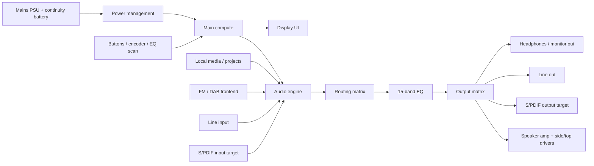

# System architecture

## Top-level architecture

## Functional modes

### 1. Player
- local library playback
- EQ graph shown by default
- transport and preset access
- 5-track overlay available for grouped playback / monitoring view

### 2. Radio
- offline radio path
- station view + scanning controls
- EQ may be applied if radio routing is enabled

### 3. Record
- line / radio capture path
- monitor bus remains visible
- record policy can be dry + metadata or printed EQ

### 4. Mixer / overlay view
- shows 5 visible tracks
- appears during EQ interaction or direct track-toggle action

## Control architecture

- UI layer = visual state + user intent
- control layer = physical input decoding / debouncing / event dispatch
- audio engine = timing, routing, EQ, transport, capture
- project state = saved locally for offline-first behaviour

## MVP rule

Do not mix the UI prototype and the future audio engine into one undefined layer.  
The repo now treats the UI as a front-end truth source and the future embedded audio engine as a separate responsibility.
